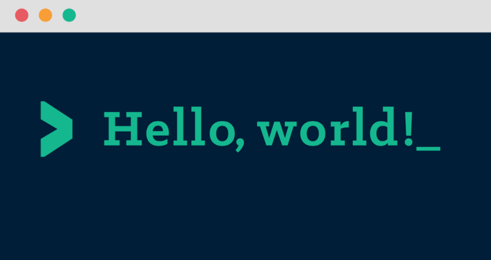

# Hi there 🙋‍♂️, I'm Jashan.

## 🤝 About Me 

- 🔭 I’m currently studying *Devops fundamentals*
- 🌱 I’m currently learning *SpringBoot* and *React.js*
- 🎯 2024 Goal: Tackle LeetCode daily to boost my coding skills and professional growth.
- 📫 Reach me at **jashansingh9890@gmail.com** 
- 🐧 I use Linux Mint, not Arch. Relax, I also use Vim.
 

## 🛠️ Skills and Languages:
<table>
  <tr>
    <td></td>
    <td></td>
    <td></td>
    <td></td>
    <td></td>
    <td></td>
    <td></td>
  </tr>
  <tr>
    <td></td>
    <td></td>
    <td></td>
    <td></td>
    <td></td>
    <td></td>
    <td></td>
  </tr>
</table>

## 🧰 Tools and Platforms
<table>
  <tr>
    <td></td>
    <td></td>
    <td></td>
    <td></td>
  </tr>
</table>

<h2 align="left">Connect with me:</h2>

   

